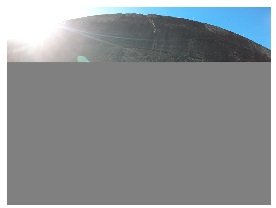
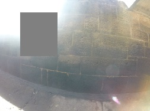
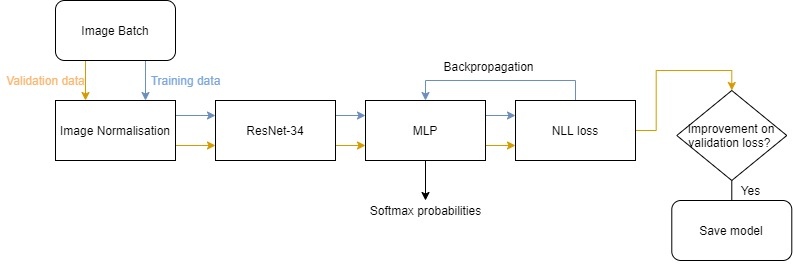
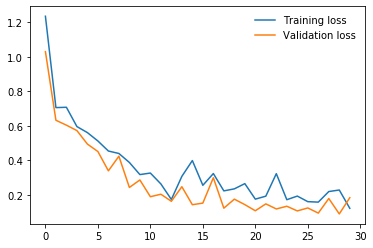

# Glare Detection in Photographs using Transfer learning

This was a project given to me by Abyss Solutions as an offline coding test, the full details can be found in the pdf. All the items required for submission may be found in this repository, and the write-up discussing the algorithm and future ideas will be inlcuded in this readme. For a full view of the process of building the model I recomend you check out the IPython notebook Transfer_learning.ipynb.

To run this you must have Python 3 with Pytorch installed.

## Introduction

Abyss Solutions is a robotics company specialising in using remotely operated underwater vehicles to inspect underwater assets. However an issue that they have encountered is the corruption of their image data due to lens flare and glare. 
The task at hand is to build a model that will be able to classify an image as being corruptted by glare or not.

For this I'll be using transfer learning on the [ResNet-34](https://arxiv.org/abs/1512.03385) Convolutional Neural Network. 

### Background information on CNNs and Transfer Learning

Convolutional neural networks (CNN) are a class of artificial neural networks that have been used extensively in computer vision. One of the main advantages that CNNs have over normal Multi-layer Perceptron networks is that they are translationally invariate, meaning that a dog, say, would be recognised regardless of its position in an image. It achieves this by passing several filters over the image, typically being a simple linear function on each pixel and its neighbours to create several feature maps. Initially these feature maps will recognise simple features such as outlines but after a few iterations of this it will soon be recognise more complex features such as noses and eyes. 

ResNet-34 is a 34 layer CNN that has been trained extensively on the [ImageNet](http://www.image-net.org/) dataset achieving a top-1 error of 26.70% and and top-5 error of 8.58. The complexity of this CNNs architecture far surpasses the practical limit of what we could train for our task, however by taking it as a pre-trained model we can then build ontop of it. This is the essence of transfer learning and the main intuition behind choosing this method to classify glare in images.

## Implementation

###  Data augmentation

Due to the small size of the training dataset (80 images), more training images were engineered from the originals in order to increase the dataset size (to 100 images) and help the model assess images with varying degrees of rotation (found in a few original images) and corruption (found in one image):

Corrupted image:

Augmented data corruption:

The data was then normalised and split into a training and validating subsets.

### Model overview

- The training dataset is split up into image batches (10 images in each batch). Then for each batch:
    - The image batch is passed into the ResNet-34 CNN which gives an 1000 length feature vector.
    - This is passed into a 3 layer MLP that gives a log-softmax output giving the predicted probabilites of the class of the images.
    - The Negative Log Likelyhood loss is then calculated using the predicted and actual class.
    - Backpropagation using gradient descent is then performed to improve the weights in the MLP.
- The above proccess is performed on the validation dataset, with the exception of the backpropagation.
- If there is an improvement on the validation loss, the model is saved.
- The above steps are repeated for a given (30) number of epochs.

## Training and Validating Perfromance 

The validation dataset was used in order to prevent overfitting the model on the dataset. When there is no longer a decrease in the validation loss its best to stop training the model. We can see how the validation loss compared to the training loss over the 30 epochs: 

The loss had began to plateau so it was best to stop the training at, in this case, epoch 29. The final training and validation negative log losses were 0.23 and 0.09 respectively, a vast improvement on the initial model. Overall the model only classified 1 false negative and 1 false positive across the training and validating dataset, with all but two of the correct classifications above 70% certainty. *To see the images have a look in the Jupyter notebook*

## Final Results

Abyss Solutions were kind enough to send me their testing data for the final evaluation. The model managed to classify to a 91.6% accuracy with only two instances of false positives.

## Future Ideas for Glare removal

For most of the corrupted images, removing the glare would be inpractical as it often dominates the image leaving little behind it to work on. However this is not always the case for some of the images that recieved only minor damages. I'll briefly outline a few ideas I've had that could be used to restore some of the photos.

#### Thresholding the intensity:
Given that the glare distorts the images with bright white light, a simple solution would be to impose a threshold on the intensity of the image. This would be very simple to implement and would help reduce the glare whilst hopefully not distorting the other parts of the image. However apart from darkenning the bright parts of the image it wont help with much else and may not provide any extra clarity

#### Histogram equalisation
*A better explanation and demonstration of histomgram equalisation can be found [here](https://docs.opencv.org/3.1.0/d5/daf/tutorial_py_histogram_equalization.html).*
Histogram equalisation is a transformation that effectively works by flattening the histogram graph of the intensity distribution. This has the effect of spreading out the most frequent intensity values, resulting in areas of low local contrast typically gaining higher contrast. This would help better discern features partially obscured by flares, however it would change the intensity of the entire image which could be an unwanted side effect.

#### Image Inpainting 
Image inpainting refers to restoring lost parts of an image based on background information, this could be used in the extreme cases of glare. There are a many very effective algorithms avalible to carry this out, [OpenCV](https://docs.opencv.org/master/df/d3d/tutorial_py_inpainting.html) offers a function that does this. The areas to be inpainted are denoted in a mask that is layered over the top of the image, typically this is done by hand, a good exxplanation of the process involved can be found in this [paper](https://www.ijsr.net/archive/v7i1/ART20179794.pdf
).

An idea to automate this process could be to train [R-CNN](https://towardsdatascience.com/r-cnn-3a9beddfd55a) to detect where the the glare is happening. Or alternatively using [Canny edge detection](https://en.wikipedia.org/wiki/Canny_edge_detector) to help distinguish between bright areas with sharp boundaries (such as the wall ending and the sky beggining) and soft boundaries (flares). Then perform inpainting on just the flares.